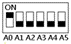

# N4D3E16 16CH RS485 IO controller commamd

*Note :*
1. *MODBUS command must be HEX*
1. *Slave ID (device address) must be consistent with the DIP switches (A0-A5)*

Default Communication: 
| Band | Data bits | Parity | Stop Bit |
| --- | --- | --- | --- |
| 9600 | 8 | None | 1 |

### Function code

| RS485 address (Station address) (1) | Function (1) | Register address (2) | Read number (2) | CRC16(2) |
| --- | --- | --- | --- | --- |
| | `03` Read | | | |
| | `06` Write | | | |
| | `0x10` (16) Write multiple registers | `0x0001`-`0x0010` | | |

| Function code | Register address | Register contents | Number of bytes | Register value | Remarks |
| --- | --- | --- | --- | --- | --- |
| `03`, `06`, `0x10`(16) | `0x0001`-`0x0010`(1-32) | Output port status | `2` | `0X0000`; `0x0001` | `0x0000` No output; `0x0001` Has output |
| `03`, `06` | `0X0070` (112) | Output port status(bit) | `2` | `01` | `0X0070`: 1-16 Output channels; Only support open and close commands. (`[1]` open, `[0]` close) |
| `03` | `0x0081`-`0x0090`(129-144) | Input port status | `2` | `0X0000`; `0x0001` | NPN Inputs `0x0000`: No input; `0x0001`: Has input |
| `03` | `0X00C0`(192) | Input port status (bit) | `2` | `[0]` No input; `[1]` Has input | `0X00C0`: 1-16 Input channels
| `03`, `06` | `0x00F9`(249) | Remote IO Sender | `2` | 0.2 seconds | `0` Disabled(default); `1`-`255`: 0.2-51 seconds to send once |
| `03`, `06` | `0x00FA`(250) | Remote IO Receiver | `2` | | `0` Disabled(default), `1` Enable |
| `03`, `06` | `0x00FC`(252) | automatic reporting selection | `2` | | `0`: Select automatic report register: `0x0081`-`0x090`; `1`: Select automatic report register: `0X00C0` |
| `03`, `06` | `0x00FD`(253) | Input port status automatic reporting function | `2` | seconds | `0`: Query function(default); `1`-`255`: Automatically report, the unit is second.; `1`: Report every 1 second; `2`: Report every 2 seconds; `10`: Report every 10 seconds - Maximum interval of 255 seconds |
| `03` | `0x00FE`(254) | 485 address | `2` | | DIP switch settings Read only |
| `03`, `06` | `0x00FF`(255) | Baud rate | `2` | `0x0000`-`0x0005` | 0~5 `0x00`:1200 `0x01`:2400 `0x02`:4800 `0x03`:9600（default）`0x04`:19200 `0x05`: Factory reset |

**MODBUS** 06 Command ( **Control command** ,HEX):

| Bytes Number | 1 | 2 | 3 | 4 | 5 | 6 | 7 | 8 |
| --- | --- | --- | --- | --- | --- | --- | --- | --- |
| MODBUS Definitions | Slave ID | Function | Address | Data | | CRC Check |
| Function | Device Address | Function | Channel number | Command | Delay time | CRC Check |
| Open | `0x00`-`0x2F`  | `0x06` | `0x0001`-`0x0008` | `0x01` | `0x00` | 2Bytes CRC |
| Close | `0x00`-`0x2F`  | `0x06` | `0x0001`-`0x0008` | `0x02` | `0x00` | 2Bytes CRC |
| Toggle (Self-locking) | `0x00`-`0x2F`  | `0x06` | `0x0001`-`0x0008` | `0x03` | `0x00` | 2Bytes CRC |
| Latch Inter-locking) | `0x00`-`0x2F`  | `0x06` | `0x0001`-`0x0008` | `0x04` | `0x00` | 2Bytes CRC |
| Momentary (Non-locking) | `0x00`-`0x2F`  | `0x06` | `0x0001`-`0x0008` | `0x05` | `0x00` | 2Bytes CRC |
| Delay | `0x00`-`0x2F`  | `0x06` | `0x0001`-`0x0008` | `0x06` | `0x00`-`0xFF` | 2Bytes CRC |
| Open all | `0x00`-`0xFE` | `0x06` | `0x0000` | `0x07` | `0x00` | 2Bytes CRC |
| Close all | `0x00`-`0xFE` | `0x06` | `0x0000` | `0x08` | `0x00` | 2Bytes CRC |

Remarks:
1. Momentary mode, delay time is 1 seconds
1. Delay mode, delay time is 1-255 seconds
1. `0x0001`-`0x0010` registers not only support 06 function code, but also support `0x10` (16) function code

Return command： 
  Command is active, return to send commands; instruction is invalid no return.

### MODBUS 03 Command (**Read status command**, HEX):

| Bytes Number | 1 | 2 | 3 | 4 | 5 | 6 | 7 | 8 |
| --- | --- | --- | --- | --- | --- | --- | --- | --- |
| MODBUS Definitions | Slave ID | Function | Address | Data | CRC Check |
| Function | Device Address | Function | Starting register address | Register length | CRC Check |
| Read Channel 1 State | `0x00`-`0x2F`  | `0x03` | `0x0001` | `0x0001` | |
| Read Channel 2 State | `0x00`-`0x2F`  | `0x03` | `0x0002` | `0x0001` | |
| Read 2 consecutive channels status | `0x00`-`0x2F`  | `0x03` | `0x0001`-`0x0003` | `0x0002` | |
| Read 3 consecutive channels status | `0x00`-`0x2F`  | `0x03` | `0x0001`-`0x0002` | `0x0003` | |
| Read all 8 channels status | `0x00`-`0x2F`  | `0x03` | `0x0001` | `0x0008` | |
| | | | | | |
| Read input1 status | `0x00`-`0xFE` | `0x03` | `0x0081` | `0x0001` | |
| Read input2 status | `0x00`-`0xFE` | `0x03` | `0x0082` | `0x0001` | |
| Read input3 status | `0x00`-`0xFE` | `0x03` | `0x0083` | `0x0001` | |
| Read input4 status | `0x00`-`0xFE` | `0x03` | `0x0084` | `0x0001` | |
| Read the status of 2 consecutive input ports | `0x00`-`0xFE` | `0x03` | `0x0081`-`0x0087` | `0x0002` | |
| Read the status of 3 consecutive input ports | `0x00`-`0xFE` | `0x03` | `0x0081`-`0x0086` | `0x0003` | |
| Read 8 input port status | `0x00`-`0xFE` | `0x03` | `0x0081` | `0x0008` | |

### Read status command returns (function code 03, HEX format):

| Bytes length | 1 | 1 | 1 | | 2 |
| --- | --- | --- | --- | --- | --- |
| MODBUS Definitions | Slave ID | Function | data length | data | CRC16 Check |
| Function | Device Address | Function | data length | Relay state `0x0001` open, `0x0000` close | CRC16 Check |
| Channel 1 open | 0x00-0x1F | `0x03` | `0x02` | `0x0001` | |
| Channel 1 close | 0x00-0x1F | `0x03` | `0x02` | `0x0000` | |
| Channel 2 open | 0x00-0x1F | `0x03` | `0x02` | `0x0001` | |
| Channel 2 close | 0x00-0x1F | `0x03` | `0x02` | `0x0000` | |
| Channel 1 open & Channel 2 open | `0x00`-`0x1F` | `0x03` | `0x04` | `0x0001` `0x0001` | |
| Channel 1 open & Channel 2 close | `0x00`-`0x1F` | `0x03` | `0x04` | `0x0001` `0x0000` | |
| Channel 1 close & Channel 2 open | `0x00`-`0x1F` | `0x03` | `0x04` | `0x0000` `0x0001` | |
| Channel 1 close & Channel 2 close | `0x00`-`0x1F` | `0x03` | `0x04` | `0x0000` `0x0000` | |
| | | | | | |
| Input 1 On | `0x00`-`0xFE` | `0x03` | `0x02` | `0x0001` | |
| Input 1 Off | `0x00`-`0xFE` | `0x03` | `0x02` | `0x0000` | |
| Input 2 On | `0x00`-`0xFE` | `0x03` | `0x02` | `0x0001` | |
| Input 2 Off | `0x00`-`0xFE` | `0x03` | `0x02` | `0x0000` | |
| Input 1 On & Input 2 On | `0x00`-`0xFE` | `0x03` | `0x04` | `0x0001` `0x0001` | |
| Input 1 On & Input 2 Off | `0x00`-`0xFE` | `0x03` | `0x04` | `0x0001` `0x0000` | |
| Input 1 Off & Input 2 On | `0x00`-`0xFE` | `0x03` | `0x04` | `0x0000` `0x0001` | |
| Input 1 Off & Input 2 Off | `0x00`-`0xFE` | `0x03` | `0x04` | `0x0000` `0x0000` | |

MODBUS commands you can use "Modbus Poll" input, as shown below

（CRC check generated automatically）

You can also use HyperTerminal serial input, as shown below

（Manually add CRC check）

### Examples (Slave ID is 1,DIP switch state)
| | |
| --- | --- |
| Channel 1 Open | `01 06 00 01 01 00 D9 9A` |
| Channel 1 Close | `01 06 00 01 02 00 D9 6A` |
| Channel 1 Toggle | `01 06 00 01 03 00 D8 FA` |
| Channel 1 Latch | `01 06 00 01 04 00 DA CA` |
| Channel 1 Momentary | `01 06 00 01 05 00 DB 5A` |
| Channel 1 Delay 10 seconds | `01 06 00 01 06 0A 5B AD` |
| Channel 1 Delay 100 seconds | `01 06 00 01 06 64 DA 41` |
| Channel 2 Open | `01 06 00 02 01 00 29 9A` |
| Channel 2 Close | `01 06 00 02 02 00 29 6A` |
| Channel 2 Toggle | `01 06 00 02 03 00 28 FA` |
| Channel 2 Latch | `01 06 00 02 04 00 2A CA` |
| Channel 2 Momentary | `01 06 00 02 05 00 2B 5A` |
| Channel 2 Delay 10 seconds | `01 06 00 02 06 0A AB AD` |
| Channel 2 Delay 100 seconds | `01 06 00 02 06 64 2A 41` |
| Open all | `01 06 00 00 07 00 8B FA` |
| Close all | `01 06 00 00 08 00 8E 0A` |
| `0x10` (16) function code (only supports `0x0001`-`0x0010` registers) |  |
| Open all | `01 10 00 01 00 10 20 01 00 01 00 01 00 01 00 01 00 01 00 01 00 01 00 01 00 01 00 01 00 01 00 01 00 01 00 01 00 01 00 F5 B0` |
| Close Channels1-4 | `01 10 00 01 00 04 08 02 00 02 00 02 00 02 00 CB 5A` |
| Close Channels 5-8 | `01 10 00 05 00 04 08 02 00 02 00 02 00 02 00 3A 95` |
| Read state (assuming that the channel 1 is open, the channel 2 is close). | |
| Read channel 1 state | `01 03 00 01 00 01 D5 CA` |
| Return open | `01 03 02 00 01 79 84` |
| Read channel 2 state | `01 03 00 02 00 01 25 CA` |
| Return close | `01 03 02 00 00 B8 44` |
| Read channel 1 and channel 2 state | `01 03 00 01 00 02 95 CB` |
| Return channel open and channel 2 close | `01 03 04 00 01 00 00 AB F3` |
| Read 1-8 channel input status | `01 03 00 81 00 08 14 24` |
| Return all input channels OFF | `01 03 10 00 00 00 00 00 00 00 00 00 00 00 00 00 00 00 00 E4 59` |
| Return input channel 1 ON：| `01 03 10 00 01 00 00 00 00 00 00 00 00 00 00 00 00 00 00 25 59` |

## Read Output port status(One bit, one channel)

### Send data
| RS485 address(Station address) (1) | Function (1) | Register address (2) | Read number (2) | CRC16(2) |
| --- | --- | --- | --- | --- |
| `0x01-0xFE` | `0x03` | `0x0070` corresponds to channel 1-16 output port status | `0x0001` | |

### Returns data
| RS485 address(Station address) (1) | Function (1) | Number of bytes (1) | data (n) | CRC16(2) |
| --- | --- | --- | --- | --- |

For example: Read 1-16 channel output port status:

Send data(RS485 address is 1)：`01 03 00 70 00 01 85 D1`

Returns data：`01 03 02 02 02 38 E5`

`01` RS485 address，`03` Function，`02` length，`38 E5` crc16

`02 02` refers to the status of the output port, the second and tenth bits are 1, and the other bits are 0. So channels 2 and 10 are open, and the other channels are closed.

## Write Output port status(One bit, one channel)

### Send data
| RS485 address(Station address) (1) | Function (1) | Register address (2) | Read number (2) | CRC16(2) |
| --- | --- | --- | --- | --- |
| `0x01-0xFE` | `0x06` | `0x0070` corresponds to channel 1-16 output port status | `0x0001` | |

### Returns data
| RS485 address(Station address) (1) | Function (1) | Number of bytes (1) | data (n) | CRC16(2) |
| --- | --- | --- | --- | --- |

For example: Open channel 1/2/3, other channels close:

Send data(RS485 address is 1)：`01 06 00 70 00 07 C9 D3`

Returns data：`01 06 00 70 00 07 C9 D3`

`01` RS485 address，`06` Function，`C9 D3` crc16

`00 70` refers to the registers of 1-16 channels; `00 07` refers to 1-3 channels open and 4-16 channels closed.

## Read input port status(One register, one channel)
| Pysical Input | Value |
| --- | --- | 
| `0x0000` | No input, NPN input, the port is high or floating |
| `0x0001` | has input, NPN input, the port is low level |
### Send data
| RS485 address(Station address) (1) | Function (1) | Register address (2) | Read number (2) | CRC16(2) |
| --- | --- | --- | --- | --- |
| `0x01`-`0xFE` | `0x03` | `0x0081`-0x0090 IN1-IN16 channels input port status | `0x0001`-0x0010 |

### Returns data
| RS485 address(Station address) (1) | Function (1) | Number of bytes (1) | data (n) | CRC16(2) |
| --- | --- | --- | --- | --- |

For example: Read channel IN1 port value:

Send data(RS485 address is 1)：`01 03 00 81 00 01 D4 22`

Returns data：`01 03 02 00 01 79 84`

`01` (RS485 address)，`03` (Function)，`02` (length)，`79 84` (crc16)

`00 01` means there is input. NPN input, then port IN1 is low level

For example: Read channel IN2 port value:

Send data(RS485 address is 1)：`01 03 00 82 00 01 24 22`

Returns data：`01 03 02 00 00 B8 44`

`01` RS485 address，`03` Function，`02` length，`B8 44` crc16

`00 00` means no input. NPN input, then port IN2 is floating or high level.

## Read input port status(One bit, one channel)

### Send data
| RS485 address(Station address) (1) | Function (1) | Register address (2) | Read number (2) | CRC16(2) |
| --- | --- | --- | --- | --- |
| `0x01`-`0xFE` | `0x03` | `0x00C0` IN1-IN16 channels input port status | `0x0001` | |

### Returns data
| RS485 address(Station address) (1) | Function (1) | Number of bytes (1) | data (n) | CRC16(2) |
| --- | --- | --- | --- | --- |

The 16-bit data of 0x00C0 Register indicates the input status of channels IN1-IN16, 0 means no input, 1 means input

For example: Read channel IN1-IN16 port value:

Send data(RS485 address is 1)：`01 03 00 C0 00 01 84 36`

Returns data：`01 03 02 00 80 B9 E4`

`01` RS485 address，`03` Function，`02` length，`B9 E4` crc16

`00 80` represents the input status of IN1-IN16, the eighth bit is 1, the other bits are 0; it means that IN8 has input, and other channels have no input

## Remote IO Sender

### Send data
| Command | RS485 address(Station address) (1) | Function (1) | Register address (2) | Read number (2) | CRC16(2) |
| --- | --- | --- | --- | --- | --- |
| read | `0x01`-`0xFE` | `0X03` | `0x00F9` | `0x0001` | |
| write | `0x01`-`0xFE` | `0x06`  | `0x00F9` | `0x0001` | |

### Returns data
| RS485 address(Station address) (1) | Function (1) | Number of bytes (1) | data (n) | CRC16(2) |
| --- | --- | --- | --- | --- |

Configure this register, the N4D3E16 board will actively send IN1-IN16 input status to control the output ports CH1-CH16 of another N4D3E16 board, and the RS485 addresses of the two boards must be the same. The unit is 0.2 seconds. 0 prohibited 1-255 means sending once every 0.2-51 seconds

For example, if remote IO sending is currently prohibited, it should be changed to allow remote IO sending:
| | |
| --- | --- |
| 0.2 seconds, send data(RS485 address is 1)  | `01 06 00 F9 00 01 98 3B` |
| 0.4 seconds, send frame (address is 1) | `01 06 00 F9 00 02 D8 3A` |
| 0.6 seconds, send frame (address is 1) | `01 06 00 F9 00 03 19 FA` |
| 0.8 seconds, send frame (address is 1) | `01 06 00 F9 00 04 58 38` |
| 1 second, send frame (address is 1) | `01 06 00 F9 00 05 99 F8` |
| Disable remote IO sending: send frame (address is 1) | `01 06 00 F9 00 00 59 FB` |

## Remote IO Receiver

### Send data
| Command | RS485 address(Station address) (1) | Function (1) | Register address (2) | Read number (2) | CRC16(2) |
| --- | --- | --- | --- | --- | --- |
| read  | `0x01`-`0xFE` | `0X03` | `0x00FA` | `0x0001` |
| write | `0x01`-`0xFE` | `0x06` | `0x00FA` | `0x0001` |

### Returns data
| RS485 address(Station address) (1) | Function (1) | Number of bytes (1) | data (n) | CRC16(2) |
| --- | --- | --- | --- | --- |

When Remote IO Receiver is allowed, please configure this register to 1.

*Note: When this register is configured as 1, register 0x0070 does not return 06 function code*
| | |
| --- | --- |
| If allow remote IO reception: send frame (address is 1) | `01 06 00 FA 00 01 68 3B` |
| If prohibit remote IO reception: send frame (address is 1) | `01 06 00 FA 00 00 A9 FB` |

## Automatic report selection register

### Send data
| command | RS485 address(Station address) (1) | Function (1) | Register address (2) | Setting Content (2) | CRC16(2) |
| --- | --- | --- | --- | --- | --- |
| read  | `0x01`-`0xFE` | `0X03` | `0x00FC` | 1 Bytes | | 
| write | `0x01`-`0xFE` | `0x06` | `0x00FC` | 1 Bytes | | 

### Returns data
| RS485 address(Station address) (1) | Function (1) | Register address (2) | Register value (2) | CRC16(2) |
| --- | --- | --- | --- | --- |

For example :
1. Select register 0x0080-0x090 to report automatically:  
  Send data(RS485 address is 1)：`01 06 00 FC 00 00 49 FA`
1. Select register 0x00C0 to report automatically:  
  Send data(RS485 address is 1)：`01 06 00 FC 00 01 88 3A`

## Set Input port status reporting function(316 channels set at the same time)

### Send data
| command| RS485 address(Station address) (1) | Function (1) | Register address (2) | Setting Content (2) | CRC16(2) |
| --- | --- | --- | --- | --- | --- |
| read  | `0x01`-`0xFE` | `0X03` | `0x00FD` | 1 Bytes | |
| write | `0x01`-`0xFE` | `0x06` | `0x00FD` | 1 Bytes | |

### Returns data
| RS485 address(Station address) (1) | Function (1) | Register address (2) | Register value (2) | CRC16(2) |
| --- | --- | --- | --- | --- |

For example : For example, the current query function should be changed to automatic reporting:
| | |
| --- | --- |
| Automatically report in 1 second, send frame (address is 1) | `01 06 00 FD 00 01 D9 FA` |
| Automatically report in 2 second, send frame (address is 1) | `01 06 00 FD 00 02 99 FB` |
| Automatically report in 3 second, send frame (address is 1) | `01 06 00 FD 00 03 58 3B` |
| Automatically report in 4 second, send frame (address is 1) | `01 06 00 FD 00 04 19 F9` |
| Automatically report in 5 second, send frame (address is 1) | `01 06 00 FD 00 05 D8 39` |
| Automatically report in 10 second, send frame (address is 1) | `01 06 00 FD 00 0A 98 3D` |
| Disable reporting function: send frame (address is 1) | `01 06 00 FD 00 00 18 3A` |

## Read baud rate

### Send data
| RS485 address(Station address) (1) | Function (1) | Register address (2) | Read number (2) | CRC16(2) |
| --- | --- | --- | --- | --- |
| `0x01`-`0xFE` | `0X03` | `0x00FF` | `0x0001` | |

### Returns data
| RS485 address(Station address) (1) | Function (1) | Number of bytes (1) | data (n) | CRC16(2) |
| --- | --- | --- | --- | --- |
| `0x01`-`0xFE` | `0X03` | `0x00FF` | `0x0000`-`0x0004` | |

For example:

send data(RS485 address is 1)：`01 03 00 FF 00 01 B4 3A`

Returns data：`01 03 02 00 03 F8 45`

`01` (RS485 address)，`03` (Function)，`02` (length)，`F8 45` (crc16)

`03` means the current baud rate is 9600bps

| **Baud rate** | 1200 | 2400 | 4800 | 9600 | 19200 |
| --- | --- | --- | --- | --- | --- |
| **Value** | `0x00` | `0x01` | `0x02` | `0x03` | `0x04` |

## Write baud rate

### Send data
| RS485 address(Station address) (1) | Function (1) | Register address (2) | Setting Content (2) | CRC16(2) |
| --- | --- | --- | --- | --- |
| `0x01`-`0xFE` | `0X03` | `0x00FF` | `0x0000`-`0x0004` | |

### Returns data
| RS485 address(Station address) (1) | Function (1) | Register address (2) | Register value (2) | CRC16(2) |
| --- | --- | --- | --- | --- |
| `0x01`-`0xFE` | `0X03` | `0x00FF` | `0x0000`-`0x0004` | |

For example,Change the baud rate to 4800bps:

send data(RS485 address is 1)：`01 06 00 FF 00 02 38 3B`

Returns data：`01 06 00 FF 00 02 38 3B`

| **Baud rate** | 1200 | 2400 | 4800 | 9600 | 19200 |
| --- | --- | --- | --- | --- | --- |
| **Value** | `0x00` | `0x01` | `0x02` | `0x03` | `0x04` |

## Factory reset

_Note:_
1. _The baud rate will be updated when the module is powered up again!_
2. _The factory setting can be restored when the baud rate corresponding to the number is 5._  
  For example:_ `01 06 00 FF 00 05 79 F9`

#### Register Addresses:
* Inputs: 129-144
* Outputs: 1-16
* Write Outputs as Binary: 112 
* Read Inputs as Binary: 192
